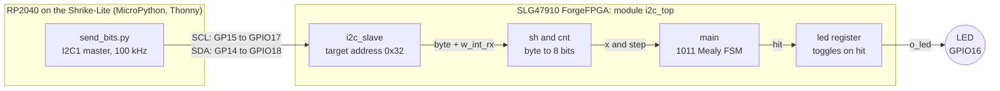
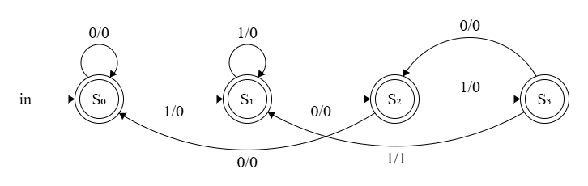
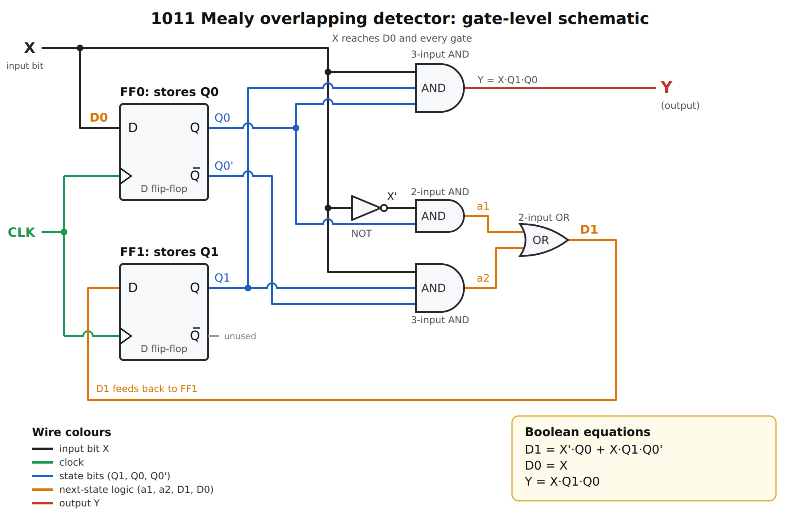
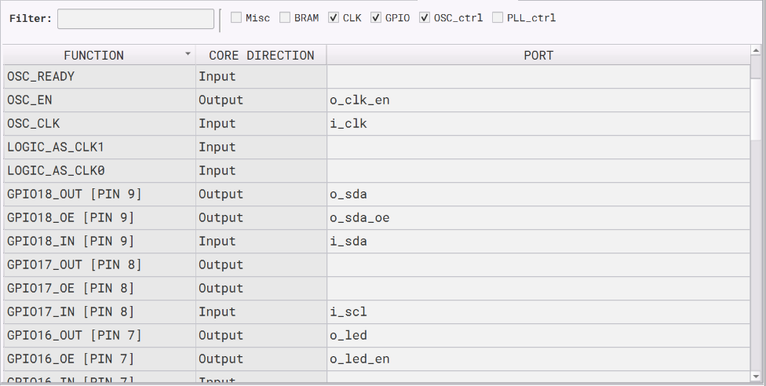
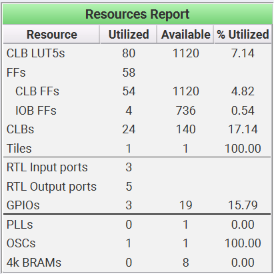

# 1011 Mealy Overlapping Sequence Detector on Shrike-Lite

| Difficulty | Uses MCU | External hardware |
|---|---|---|
| Intermediate | Yes (the RP2040 sends the bit stream over I2C) | None |

A `1011` sequence detector (Mealy machine, overlapping matches) built from **two D flip-flops** and a handful of gates, running on the Renesas **SLG47910 ForgeFPGA** of the [Vicharak Shrike-Lite](https://github.com/vicharak-in/shrike). The RP2040 sends a stream of bits over **I2C**, the FPGA looks for `1011` in that stream, and the on-board FPGA LED (**GPIO16**) **toggles** every time the pattern is found.

The project follows the whole digital-design flow, from the state diagram and K-maps to the gate-level schematic, the Verilog, the bitstream and a test on real hardware.

## Contents

[Overview](#overview) · [How it works](#how-it-works) · [Designing the detector](#designing-the-detector) · [Verilog implementation](#verilog-implementation) · [Pin usage](#pin-usage) · [Resource usage](#resource-usage) · [Hardware setup](#hardware-setup) · [Build the bitstream](#build-the-bitstream) · [Flash and run with Thonny](#flash-and-run-with-thonny) · [Verify it works](#verify-it-works) · [Troubleshooting](#troubleshooting) · [Credits](#credits) · [License](#license)

## Overview

A sequence detector watches a serial input one bit per clock and raises an output when the last bits it saw match a pattern. Ours looks for `1011`:

- **Overlapping:** the end of one match can be the start of the next, so `1011011` contains two matches.
- **Mealy:** the output depends on the current state *and* the current input, so it goes high in the same clock cycle in which the last `1` arrives.
- **Fed over I2C:** the RP2040 (MicroPython, run from Thonny) writes bytes to the FPGA. Each byte is 8 bits of the stream, sent MSB first.
- **Visible result:** the FPGA LED on GPIO16 flips state on every detection.

## How it works



1. **RP2040 → FPGA.** `send_bits.py` turns a string such as `10110000` into bytes and writes them to I2C address `0x32`.
2. **I2C target.** The `i2c_slave` module (from Renesas) receives each byte and pulses `w_int_rx` for one clock when a byte has arrived.
3. **Byte to bits.** `i2c_top` loads the byte into an 8-bit shift register `sh` and a counter `cnt`. For the next 8 FPGA clocks it presents one bit per clock on `x` (MSB first) and raises `step` to say "this bit is valid".
4. **Detector.** The `main` module is the 1011 Mealy FSM. It only moves when `step` is high, so it advances exactly once per data bit even though the FPGA clock (50 MHz internal oscillator) is far faster than I2C (100 kHz).
5. **LED.** When the FSM raises `hit`, the `led` register flips and drives the LED pin.

The FSM keeps its state between bytes and between separate I2C writes, so a pattern can straddle a byte boundary.

## Designing the detector

This is the classic design flow for a synchronous sequential circuit.

### Problem statement

Detect `1011` in a serial input `X`, one bit per clock, with overlap, using a Mealy output `Y` (`Y = 1` when the last four bits received are `1011`).

### State diagram

Each state remembers how much of the pattern has been matched so far. Arrows are labelled `input/output`.

| State | Meaning (the tail of the input seen so far) |
|---|---|
| S0 | nothing useful yet |
| S1 | `1` |
| S2 | `10` |
| S3 | `101` |



Only the transition **S3 --1--> S1** has output 1. It goes to S1 rather than S0 because the `1` that just completed the pattern is also the first `1` of a possible next pattern. That single arrow is what makes the detector *overlapping*.

### State table

| Present state | Next state, X = 0 | Next state, X = 1 | Output Y, X = 0 | Output Y, X = 1 |
|---|---|---|---|---|
| S0 | S0 | S1 | 0 | 0 |
| S1 | S2 | S1 | 0 | 0 |
| S2 | S0 | S3 | 0 | 0 |
| S3 | S2 | S1 | 0 | 1 |

### State assignment

Four states need `2` flip-flops. We call their outputs `Q1` (MSB) and `Q0` and use plain binary codes:

| S0 | S1 | S2 | S3 |
|---|---|---|---|
| 00 | 01 | 10 | 11 |

The state table then becomes:

| Present state Q1 Q0 | Next state, X = 0 | Next state, X = 1 | Y, X = 0 | Y, X = 1 |
|---|---|---|---|---|
| 00 | 00 | 01 | 0 | 0 |
| 01 | 10 | 01 | 0 | 0 |
| 10 | 00 | 11 | 0 | 0 |
| 11 | 10 | 01 | 0 | 1 |

### Excitation table and D inputs

A D flip-flop copies its input to its output at the clock edge (`Q+ = D`), so the flip-flop inputs are simply the next-state bits: `D1 = Q1+` and `D0 = Q0+`. That is why D flip-flops are the easiest choice: JK or T flip-flops would need an extra excitation table.

| X | Q1 | Q0 | Q1+ | Q0+ | D1 | D0 | Y |
|---|---|---|---|---|---|---|---|
| 0 | 0 | 0 | 0 | 0 | 0 | 0 | 0 |
| 0 | 0 | 1 | 1 | 0 | 1 | 0 | 0 |
| 0 | 1 | 0 | 0 | 0 | 0 | 0 | 0 |
| 0 | 1 | 1 | 1 | 0 | 1 | 0 | 0 |
| 1 | 0 | 0 | 0 | 1 | 0 | 1 | 0 |
| 1 | 0 | 1 | 0 | 1 | 0 | 1 | 0 |
| 1 | 1 | 0 | 1 | 1 | 1 | 1 | 0 |
| 1 | 1 | 1 | 0 | 1 | 0 | 1 | 1 |

### Simplifying with K-maps

Columns are in Gray-code order (`Q1Q0` = 00, 01, 11, 10).

```
D1          Q1Q0
           00  01  11  10
   X = 0    0   1   1   0     <- pair (Q0 = 1, X = 0)   -> X'·Q0
   X = 1    0   0   0   1     <- single cell            -> X·Q1·Q0'

D0          Q1Q0
           00  01  11  10
   X = 0    0   0   0   0
   X = 1    1   1   1   1     <- whole row              -> X

Y           Q1Q0
           00  01  11  10
   X = 0    0   0   0   0
   X = 1    0   0   1   0     <- single cell            -> X·Q1·Q0
```

Result (a prime `'` means NOT):

```
D1 = X'·Q0 + X·Q1·Q0'
D0 = X
Y  = X·Q1·Q0
```

### Digital schematic



A dot means two wires are connected; a small hop means they cross without connecting.

| Part | Count | Realises |
|---|---|---|
| D flip-flop | 2 | the state bits `Q1` and `Q0` (FF1 and FF0) |
| Inverter (NOT) | 1 | `X'` |
| 2-input AND | 1 | `a1 = X'·Q0` |
| 3-input AND | 2 | `a2 = X·Q1·Q0'` and the output `Y = X·Q1·Q0` |
| 2-input OR | 1 | `D1 = a1 + a2` |

`D0 = X` needs no gate: the input goes straight into FF0. `Q0'` comes from the inverted output (Q̄) of FF0, so no second inverter is needed. Both flip-flops share the same clock. Inside the FPGA the gates are packed into LUTs and the flip-flops are the CLB flip-flops.

### What the flip-flops do

Gates alone have no memory, but the detector has to remember how much of `1011` it has already seen. The two flip-flops are that memory: two bits hold one of four states.

- **Q1, Q0** are the present state. **D1, D0** are the next state, computed by the gates from `X`, `Q1` and `Q0`.
- On every rising clock edge both flip-flops copy D to Q at the same instant, so the machine moves from one state to the next.
- Between clock edges nothing changes, which keeps the circuit stable while the gates settle.

In the FPGA version each of the two FSM flip-flops also has a **clock enable** (`en`): it only loads when `en = 1`. The full design uses these flip-flops in our own logic:

| Register | Bits | Job |
|---|---|---|
| `q1`, `q0` (in `main`) | 2 | detector state |
| `sh` | 8 | holds the received byte and shifts it out |
| `cnt` | 4 | counts the bits still to send |
| `led` | 1 | remembers the LED state (toggles on each hit) |

The rest of the flip-flops in the resource report belong to the I2C target and the I/O blocks.

### Why Mealy

The output `Y = X·Q1·Q0` uses the input `X` directly, so it fires in the same cycle as the last `1`. A Moore version, whose output depends only on the state, would need a fifth state (and a third flip-flop) and would fire one clock later.

## Verilog implementation

| File | Purpose |
|---|---|
| [`ffpga/src/main.v`](ffpga/src/main.v) | the 1011 Mealy FSM (the module from the schematic above) |
| [`ffpga/src/i2c_top.v`](ffpga/src/i2c_top.v) | top module: I2C target, byte-to-bit shifter, FSM instance, LED toggle, pin control |
| [`ffpga/lib/i2c_slave.v`](ffpga/lib/i2c_slave.v) | I2C target from Renesas (unchanged, see [Credits](#credits)) |
| [`ffpga/sim/tb_i2c_top.v`](ffpga/sim/tb_i2c_top.v) | our self-checking testbench for the whole design |
| [`ffpga/sim/i2c_slave_tb.vt`](ffpga/sim/i2c_slave_tb.vt) | Renesas testbench for the I2C target |

### main.v

```verilog
module main(input wire clk, input wire en, input wire x, output wire y);

    reg q1, q0;                       // the two D flip-flops = present state

    wire x_n  = ~x;                   // the inverter
    wire q0_n = ~q0;                  // Q0' (Q-bar of FF0)

    wire a1 = x_n & q0;               // 2-input AND   X'.Q0
    wire a2 = x & q1 & q0_n;          // 3-input AND   X.Q1.Q0'
    wire d1 = a1 | a2;                // 2-input OR    D1
    wire d0 = x;                      //               D0

    assign y = x & q0 & q1;           // Mealy output, 3-input AND

    always @(posedge clk) begin
        if (en) begin                 // only advance when a valid bit is present
            q1 <= d1;
            q0 <= d0;
        end
    end
endmodule
```

- Every `wire` line is one gate from the schematic, so the code mirrors the drawing.
- `reg q1, q0` plus the `always @(posedge clk)` block are the two D flip-flops. `<=` makes both update together at the clock edge.
- `if (en)` is the clock enable. When `en = 0` the flip-flops keep their value.
- `y` is not qualified by `en`: when no bit is being shifted, `sh` holds zeros, so `x = 0` and `y = 0`.
- Any two consecutive `0` bits bring the FSM back to S0 from any state. We use this to "flush" it (see [Verify it works](#verify-it-works)).

### i2c_top.v

**Ports and attributes.** `(* top *)` marks the top module. `(* iopad_external_pin *)` tells Go Configure the port goes to a physical pad, so it appears in the I/O Planner. `clkbuf_inhibit` on `i_clk` stops the tool from adding a clock buffer to the oscillator net (the spelling matters). The parameter `I2C_SLAVE_ADR = 7'h32` is the I2C address and is passed to the `i2c_slave`.

**Open-drain SDA.** An FPGA pad has three separate signals: what we drive out (`o_sda`), whether the driver is on (`o_sda_oe`) and what we read (`i_sda`). I2C is open-drain, so the FPGA may only pull SDA low (to ACK) or let go. `o_sda` is constant 0 and `o_sda_oe` decides when the line is pulled low. `SCL` is input only because we never stretch the clock.

**Pad enables.** `assign o_clk_en = 1'b1;` turns on the internal oscillator and `assign o_led_en = 1'b1;` enables the LED pad's output driver.

**I2C target instance.** `i2c_slave ... u_i2c` receives bytes. `i_rst` is tied to 0 (no reset pin used) and `i_en` to 1. The port that matters is the pair `o_data_rx` (the byte) and `o_int_rx` (a one-clock pulse: "a byte just arrived"). `i_data_tx` is tied to 0 because the FPGA never sends data back.

**Byte to bits.**

```verilog
reg [7:0] sh;                       // shift register, MSB goes out first
reg [3:0] cnt;                      // bits still to send
wire step = |cnt;                   // 1 while a valid bit is on sh[7]
wire x    = sh[7];                  // current bit

always @(posedge i_clk) begin
    if (w_int_rx) begin  sh <= w_data_rx;  cnt <= 4'd8;  end          // new byte: load it
    else if (step) begin sh <= {sh[6:0], 1'b0};  cnt <= cnt - 4'd1; end  // shift out one bit
end
```

`|cnt` ORs all the bits of `cnt`, so `step` means "cnt is not zero". Loading a new byte has priority over shifting. Eight clocks (160 ns at 50 MHz) are enough to push out a byte long before the next one arrives over I2C (about 90 µs per byte at 100 kHz).

**Detector and LED.**

```verilog
wire hit;
main u_fsm(.clk(i_clk), .en(step), .x(x), .y(hit));   // 1011 FSM, advances once per valid bit

reg led;
always @(posedge i_clk) begin
    if (hit) led <= ~led;                              // toggle on every detection
end
assign o_led = led;
```

### i2c_slave.v

Renesas' I2C target module from the ForgeFPGA Workshop module library. It synchronises `SCL` and `SDA` to the FPGA clock, detects START and STOP, compares the 7-bit address with `I2C_TARGET_ADR`, sends the ACK bits and shifts in the data bytes. It accepts several bytes in one write, and gives one `o_int_rx` pulse per byte. We use it as-is.

### One byte, step by step

Sending `10110000` with the FSM starting in S0:

| Clock | Bit `x` | State before → after | `y` |
|---|---|---|---|
| 1 | 1 | S0 → S1 | 0 |
| 2 | 0 | S1 → S2 | 0 |
| 3 | 1 | S2 → S3 | 0 |
| 4 | 1 | S3 → S1 | **1** (LED toggles) |
| 5 | 0 | S1 → S2 | 0 |
| 6 | 0 | S2 → S0 | 0 |
| 7 | 0 | S0 → S0 | 0 |
| 8 | 0 | S0 → S0 | 0 |

## Pin usage



| Signal | Direction | FPGA pin in Go Configure | Connected to |
|---|---|---|---|
| `i_clk` | in | `OSC_CLK` | internal 50 MHz oscillator |
| `o_clk_en` | out | `OSC_EN` | oscillator enable |
| `i_scl` | in | `GPIO17 [PIN 8]` | RP2040 GP15 (I2C1 SCL) |
| `i_sda`, `o_sda`, `o_sda_oe` | in / out / output-enable | `GPIO18 [PIN 9]` | RP2040 GP14 (I2C1 SDA) |
| `o_led`, `o_led_en` | out | `GPIO16 [PIN 7]` | on-board FPGA LED |

## Resource usage

Reported by Go Configure after synthesis:



| Resource | Used | Available | % |
|---|---|---|---|
| CLB LUT5s | 80 | 1120 | 7.14 |
| Flip-flops | 58 (54 CLB + 4 IOB) | | |
| CLBs | 24 | 140 | 17.14 |
| GPIOs | 3 | 19 | 15.79 |
| Oscillator | 1 | 1 | 100 |
| PLLs, BRAMs | 0 | | |

## Hardware setup

No external hardware is needed. The RP2040 and the FPGA are wired together on the board, and the RP2040's I2C1 pins (GP14, GP15) already go to FPGA `GPIO18` and `GPIO17`. The MicroPython `I2C` driver switches on the RP2040's internal pull-ups, which worked for us at 100 kHz (Vicharak's own I2C example needs nothing extra either). Just connect the Shrike-Lite to your PC with a USB cable.

## Build the bitstream

You only need this if you want to rebuild from source. A ready-made bitstream is in `bitstream/`.

1. Install [Go Configure Software Hub](https://www.renesas.com/en/software-tool/go-configure-software-hub) and open **ForgeFPGA Workshop**.
2. Open the project file `seq_detector_1011.ffpga`, or create a new SLG47910 project and add `ffpga/src/i2c_top.v`, `ffpga/src/main.v` and `ffpga/lib/i2c_slave.v`. Set `i2c_top` as the top module.
3. Open the **I/O Planner** and assign the ports as in [Pin usage](#pin-usage).
4. Run **Synthesize**, then **Place and Route**, then **Generate Bitstream**.
5. Take `FPGA_bitstream_MCU.bin` from the project's `build/bitstream` folder. Any other file in that folder will not program the FPGA.

## Flash and run with Thonny

You need [Thonny](https://thonny.org/) and the Shrike MicroPython firmware (UF2) on the RP2040 (download it from the [Shrike releases](https://github.com/vicharak-in/shrike/releases/), hold the BOOT button while plugging in USB, and copy the UF2 onto the drive that appears). Details are in Vicharak's [getting-started guide](https://vicharak-in.github.io/shrike/getting_started.html).

1. **Connect.** Plug in the Shrike-Lite (BOOT not pressed). In Thonny choose **MicroPython (RP2040)** as the interpreter in the bottom-right corner and select the board's port. Enable **View → Files** to see the PC and the board side by side.
2. **Copy the bitstream.** Right-click `bitstream/seq_detector_1011.bin` in the PC file view and choose **Upload to /**.
3. **Flash the FPGA.** In a new Thonny file (or the Shell) run:

   ```python
   import shrike
   shrike.flash("seq_detector_1011.bin")
   ```

   If you unplug the board or the FPGA loses its configuration, flash again. To do it automatically at every boot, save these two lines as `main.py` on the board.
4. **Run the sender.** Open `firmware/micropython/send_bits.py` in Thonny and press **Run** (F5). The Shell should print:

   ```text
   I2C devices found: ['0x32']
   sent: 00000000
   bits to send (e.g. 10110000, q to quit):
   ```

5. **Send bits.** Type a bit string in the Shell and press Enter, for example `10110000`. Spaces are ignored and the stream is padded with `0` bits at the end to a whole number of bytes. Type `q` to quit.

The LED next to the FPGA (GPIO16) toggles each time `1011` is found.

<!-- Add a photo or a short video of the LED toggling here, for example images/led_demo.jpg -->

## Verify it works

### 1. In simulation

Needs [Icarus Verilog](https://steveicarus.github.io/iverilog/). From the repository root:

```bash
iverilog -g2005 -o sim ffpga/src/i2c_top.v ffpga/src/main.v ffpga/lib/i2c_slave.v ffpga/sim/tb_i2c_top.v
vvp sim
```

The testbench acts as an I2C master (like the RP2040), writes bytes to address `0x32` and checks the number of detections and the LED. Expected output:

```text
PASS  00000000  flush : total hits=0  led=0
PASS  10110000  one hit, LED on : total hits=1  led=1
PASS  10110110  two overlapping hits, LED unchanged : total hits=3  led=1
PASS  000001011 hit across a byte boundary : total hits=4  led=0
PASS  00000000  flush, no change : total hits=4  led=0
PASS  10110110  two hits, FSM keeps '10' : total hits=6  led=0
PASS  11000000  hit using the leftover '10' : total hits=7  led=1
PASS  00000000  flush, no change : total hits=7  led=1
PASS  11000000  no hit after a flush : total hits=7  led=1
PASS  10101010  no hit : total hits=7  led=1
PASS  00001011  hit on the last bit : total hits=8  led=0
ALL TESTS PASSED
```

### 2. On the board

Flash the bitstream, run `send_bits.py`, and send these strings one after another. The LED starts off.

| Step | You send | Matches | LED after | Why |
|---|---|---|---|---|
| 1 | `00000000` | 0 | off | no `1011`; only flushes the FSM |
| 2 | `10110000` | 1 | **on** | one match, LED toggles |
| 3 | `10110000` | 1 | **off** | second match toggles it back |
| 4 | `10110110` | 2 | off (unchanged) | two overlapping matches toggle it twice |
| 5 | `00000000` | 0 | off | flush |
| 6 | `000001011` | 1 | **on** | padded to `00000101 10000000`: the match straddles two bytes |
| 7 | `10101010` | 0 | on | no `1011` anywhere |
| 8 | `00001011` | 1 | **off** | match ends on the very last bit |

### Things to know

- **The LED toggles, it does not follow the input.** It changes only on a detection. `00000000` never changes it. An even number of matches in one send leaves it unchanged.
- **The FSM remembers the end of the previous send.** After `10110110` the FSM is holding `10`, so sending `11000000` next completes a real `1011` across the two writes and toggles the LED. Send `00000000` between unrelated tests to clear the memory.

## Troubleshooting

| Symptom | Likely cause and fix |
|---|---|
| LED never changes | Check that the string really contains `1011` (for example `10110000`), and that the scan found `0x32`. |
| LED changes when it should not | The FSM was holding bits from the previous send. Send `00000000` first. |
| LED does not turn off after `00000000` | By design: the LED only toggles on a match. |


## Credits

- [Vicharak Shrike-Lite](https://github.com/vicharak-in/shrike) board, documentation and MicroPython `shrike` library.
- Renesas **SLG47910 ForgeFPGA** and **Go Configure Software Hub**.
- `ffpga/lib/i2c_slave.v` and `ffpga/sim/i2c_slave_tb.vt` are © 2025 Renesas Electronics (ForgeFPGA Workshop v6.50 module library), used unchanged under the permission notice at the top of each file.

## License

The files we wrote (`main.v`, `i2c_top.v`, `tb_i2c_top.v`, `send_bits.py`, the diagrams and this README) are released under the MIT License, see [`LICENSE`](LICENSE). The two Renesas files keep their own license notice.
